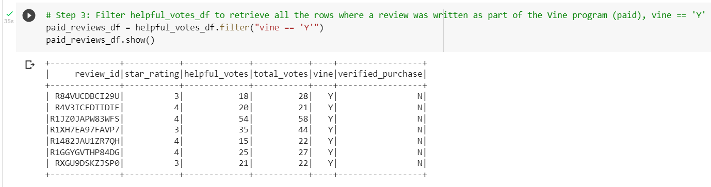
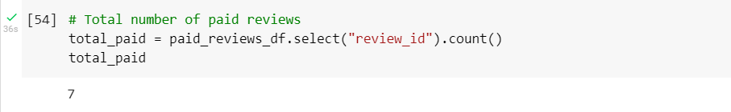
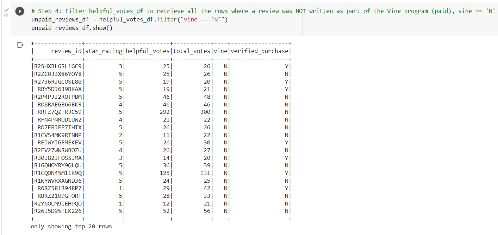
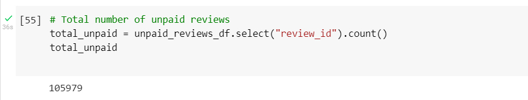
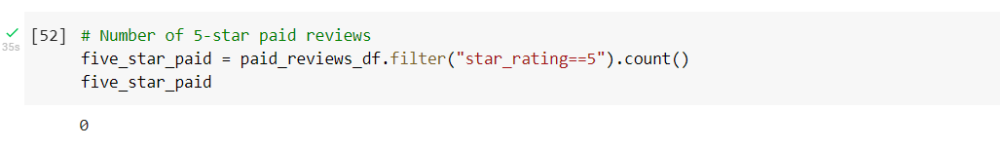
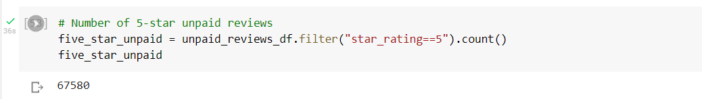
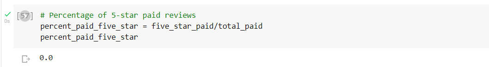
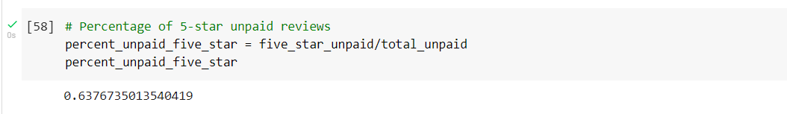

# **Amazon Vine Analysis**

## **Overview**

This project uses PySpark, AWS, and PostgresSQL to analyze Amazon Music reviews (https://s3.amazonaws.com/amazon-reviews-pds/tsv/amazon_reviews_us_Music_v1_00.tsv.gz) written by members of the paid Amazon Vine program and determine if there is any bias toward favorable reviews from Vine members in the dataset. 

## **Results**

After filtering the dataset for total votes greater than or equal to 20 and the number of helpful votes divided by total votes (>=20) equal to or greater than 50%, the results of the analysis are as follows.

#### *How many Vine reviews (paid) and non-Vine reviews (unpaid) were there?*

There were seven Vine reviews:

There were 105,979 non-Vine reviews:

#### *How many Vine reviews were 5 stars? How many non-Vine reviews were 5 stars?*

Zero Vine reviews were 5 stars:

67,580 non-Vine reviews were 5 stars:

#### *What percentage of Vine reviews were 5 stars? What percentage of non-Vine reviews were 5 stars?*

0% of Vine reviews were 5 stars:

63.77% of non-Vine reviews were 5 stars:

## **Summary**

Based on the results of the analysis, there does not appear to be positivity bias for reviews in the Amazon Music Vine program since 0% of Vine reviews gave five stars. In contrast, the non-Vine reviews had a weak majority of five star reviews at 63.77%.

An additional analysis could be run on the dataset for the percentage of five *and* four star reviews (Vine and non-Vine), since four star reviews may also be considered positive.

